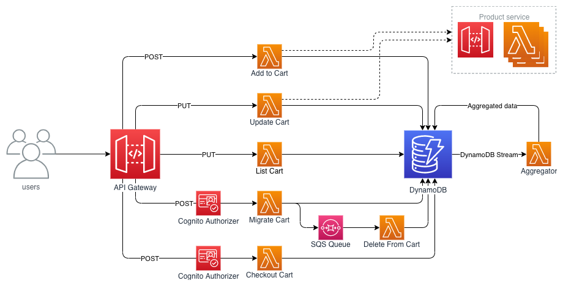

# Serverless Shopping Cart 

This application is to demonstrate how you could implement a shopping cart using 
serverless technologies on AWS. The backend is built as a REST API interface, making use of [Amazon API Gateway](https://aws.amazon.com/api-gateway/), [AWS Lambda](https://aws.amazon.com/lambda/), [Amazon Cognito](https://aws.amazon.com/cognito/), and [Amazon DynamoDB](https://aws.amazon.com/dynamodb/). The frontend is a Vue.js application using the [AWS Amplify](https://aws-amplify.github.io/) SDK for authentication and communication with the API.

## Architecture & Design

